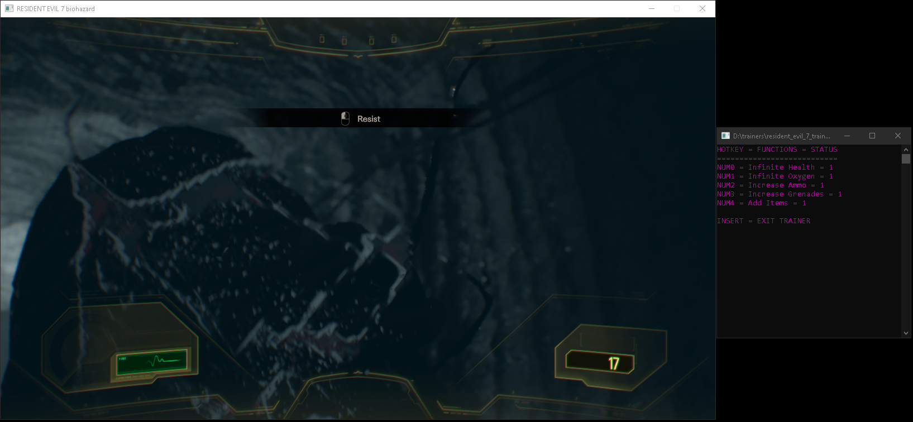

# Resident_Evil_7_Trainer
Trainer for Resident Evil 7 and DLC
 
 
Includes:
 
Cheat Engine Table (CT file)
 
Source code for c++ trainer
 
Exe for c++ trainer in x64/Debug folder
 
 
Notes:
 
Infinite health does not work in every situation.  If you get captured or instakilled, 
the game will still end and prompt you to restart like normal.
 
 
Screenshots:
 

  

 

  

 

  

