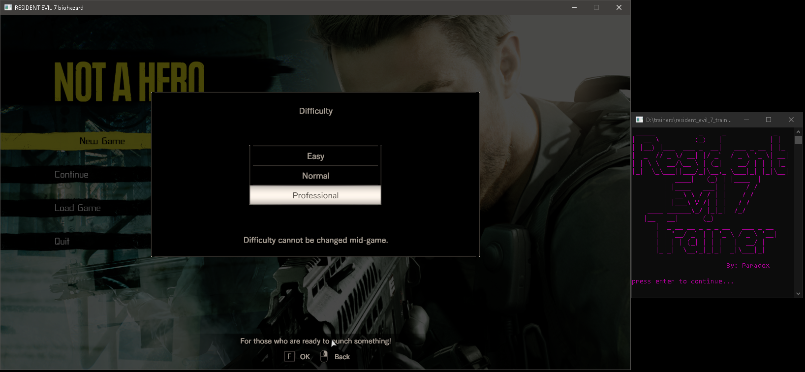

# Resident Evil 7 Trainer

A comprehensive trainer for Resident Evil 7 and DLC, providing various cheats and enhancements for gameplay.

## Credits

This project was built using tutorials and code examples from [GuidedHacking.com](https://guidedhacking.com). All credit for the original memory manipulation, process injection, and core trainer functionality goes to the GuidedHacking community and their educational resources. This project simply builds upon their foundational work and adapts it for Resident Evil 7.

Special thanks to [GuidedHacking.com](https://guidedhacking.com) for their comprehensive game hacking tutorials and code examples.

## Learn to Make Game Hacks

I learned everything I needed to know about pointer scanning and memory manipulation to hack games by using the website [GuidedHacking.com](https://guidedhacking.com). If you're interested in creating fun and easy game hacks like this, I highly recommend signing up for their website and exploring their tutorials.

## What's Included

- **Cheat Engine Table** (CT file)
- **C++ Trainer Source Code**
- **Compiled Trainer Executable** (located in `x64/Debug` folder)

## Important Notes

Infinite health does not work in every situation. If you get captured or instakilled, the game will still end and prompt you to restart like normal.

## Screenshots

  

  

  

